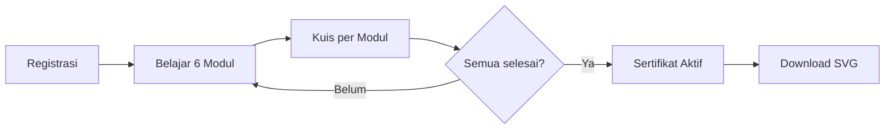

Read [](file:///d%3A/2026/Wensite-Wrangler-Training/pelatihan/lucky-river-fc0d/public/README.md)

Read [](file:///d%3A/2026/Wensite-Wrangler-Training/pelatihan/lucky-river-fc0d/public/map.html#50-50), lines 50 to 450

Saya tidak bisa langsung membuat file karena tools write sedang tidak tersedia. Berikut draf lengkapnya — kamu bisa copy-paste ke file baru `public/TUTORIAL.md`:

---

```markdown
# Panduan Pengoperasian Website

## Pelatihan Perencanaan Zonasi Spasial Kabupaten Luwu
> **Program FOLUR UNDP** — Versi 2026

---

## Daftar Isi

1. [Pengenalan](#1-pengenalan)
2. [Halaman Utama (Beranda)](#2-halaman-utama-beranda)
3. [Halaman Modul & Kuis](#3-halaman-modul--kuis)
4. [Peta Interaktif — Tampilan Umum](#4-peta-interaktif--tampilan-umum)
5. [Navigasi & Bilah Atas](#5-navigasi--bilah-atas)
6. [Panel Layer (Kiri)](#6-panel-layer-kiri)
7. [Dock Toolbar (Bawah)](#7-dock-toolbar-bawah)
8. [Digitasi & Upload Poligon](#8-digitasi--upload-poligon)
9. [Clip & Hitung Luas](#9-clip--hitung-luas)
10. [Analisis Lokasi (Titik)](#10-analisis-lokasi-titik)
11. [Ka Zoni — AI Assistant](#11-ka-zoni--ai-assistant)
12. [Tambah Layer (Upload Data)](#12-tambah-layer-upload-data)
13. [Basemap Switcher](#13-basemap-switcher)
14. [Pencarian Lokasi](#14-pencarian-lokasi)
15. [Cetak Peta](#15-cetak-peta)
16. [Sertifikat & Progres Belajar](#16-sertifikat--progres-belajar)
17. [Referensi Cepat](#referensi-cepat)

---

## 1. Pengenalan

Website ini adalah platform **WebGIS interaktif** untuk pelatihan Perencanaan Zonasi Spasial Kabupaten Luwu, Sulawesi Selatan.

**URL**: `https://lucky-river-fc0d.pelatihan-zonasi.workers.dev`

| Komponen | Fungsi |
|----------|--------|
| 🗺️ Peta Interaktif | Visualisasi 30+ layer indikator spasial |
| 📚 Modul Pelatihan | 6 modul pembelajaran + kuis interaktif |
| 🤖 Ka Zoni AI | Asisten AI untuk analisis spasial |
| 📐 Clip & Hitung Luas | Analisis area dengan poligon custom |
| 📂 Upload Layer | Tambah data sendiri (GeoJSON / Shapefile) |

> 📸 `[img/tutorial/beranda.png]`

---

## 2. Halaman Utama (Beranda)

Halaman `/` berisi: judul, logo FOLUR UNDP, ringkasan program, tombol navigasi ke Peta & Modul, dan form registrasi peserta (nama untuk sertifikat).

---

## 3. Halaman Modul & Kuis

Halaman `/modul` — 3 tab: **Kurikulum**, **Laporan Nilai**, **Sertifikat**.

| Modul | PIN Kuis |
|-------|----------|
| 1 — Konsep Dasar | `4827` |
| 2 — Metodologi MCE-GIS | `7391` |
| 3 — Enam Indikator X1–X6 | `1563` |
| 4 — Membaca Peta Zonasi | `9045` |
| 5 — Penerapan & Perizinan | `6182` |
| 6 — Pemantauan & Evaluasi | `2750` |

**Reset Progres**: PIN `1234`

> 📸 `[img/tutorial/modul.png]`

---

## 4. Peta Interaktif — Tampilan Umum

```
┌──────────────────────────────────────────────┐
│  🛡️ TRAINING RENCANA ZONASI │ 🔍 │ 🏠 Modul │
├──────────┬───────────────────┬───────────────┤
│ 📂 Panel │                   │ 🤖 Ka Zoni    │
│ Layer    │    🗺️ PETA        │ (Panel AI)    │
│ (kiri)   │                   │ (kanan)       │
│          │  ┌─────────────┐  │               │
│          │  │ Dock 3D (11)│  │               │
│          │  └─────────────┘  │               │
└──────────┴───────────────────┴───────────────┘
```

> 📸 `[img/tutorial/peta-full.png]`

---

## 5. Navigasi & Bilah Atas

| Item | Fungsi |
|------|--------|
| 🛡️ Logo + JUDUL | Identitas |
| 🔍 Search Box | Cari lokasi (Nominatim) — ketik, Enter, peta zoom |
| 🏠 | Beranda |
| Modul Pelatihan | Halaman modul |
| Peta Interaktif | Halaman aktif (highlight hijau) |

---

## 6. Panel Layer (Kiri)

Klik **📂 Layers** di Dock untuk buka/tutup.

### 6 Kelompok Indikator

| Ikon | Grup | Layer | Bobot |
|------|------|-------|-------|
| 🌿 | X1 Kerentanan Fisik | 4 | 0.136 |
| 🌾 | X2 Kerentanan Sosek | 5 | 0.080 |
| ⛰️ | X3 Daya Dukung LH | 5 | 0.258 |
| 🏔️ | X4 Kemampuan Lahan | 5 | 0.138 |
| 🏗️ | X5 Kapasitas Adaptasi | 5 | 0.167 |
| 🌍 | X6 Komoditas FOLUR | 6 | 0.120 |

**Cara pakai**: ☑ centang = layer muncul + legenda inline, ☐ hilangkan = sembunyi.

> 📸 `[img/tutorial/panel-layer.png]`

---

## 7. Dock Toolbar (Bawah)

11 tombol di dock 3D:

| # | Ikon | Nama | Status Awal |
|---|------|------|-------------|
| 1 | 📂 | Layers | Aktif |
| 2 | 🔲 | Selection | Toggle |
| 3 | ✏️ | Digitasi / Upload | Toggle |
| 4 | ✂️ | Clip & Hitung Luas | Disabled |
| 5 | 🗑️ | Hapus Poligon | — |
| 6 | 🗺️ | Base Map | Toggle |
| 7 | 🎯 | Ke Tengah | — |
| 8 | ⛶ | Layar Penuh | Toggle |
| 9 | 🖨️ | Cetak Peta | — |
| 10 | ⬇️ | Download | Disabled |
| 11 | 🤖 | Ka Zoni | Toggle |

**Indikator**: Hijau = aktif, Abu-abu = normal, Transparan = disabled.

> 📸 `[img/tutorial/dock-toolbar.png]`

---

## 8. Digitasi & Upload Poligon

1. Klik ✏️ **Digitasi / Upload**
2. Pilih mode: **Poligon** / **Garis** / **Titik** / **Upload**
3. Untuk poligon: klik peta → double-click selesai
4. Untuk upload: pilih file `.geojson` / `.json` (maks 20 MB)
5. Untuk garis/titik: atur **Buffer (m)** → otomatis jadi poligon

> 📸 `[img/tutorial/digitasi-poligon.png]`

---

## 9. Clip & Hitung Luas

1. **Buat poligon** (digitasi/upload) → ✂️ aktif
2. **Centang layer** di panel kiri
3. Klik ✂️ → panel hasil muncul di kanan atas
4. Output: luas per kelas (ha) per layer + **grand total**
5. Ka Zoni **otomatis membuka** dan menganalisis hasil

> 📸 `[img/tutorial/clip-hitung-luas.png]`

---

## 10. Analisis Lokasi (Titik)

1. ✏️ → **Titik**
2. Klik satu titik di peta
3. Hasil: tabel semua layer aktif + kelas pada koordinat tersebut

> 📸 `[img/tutorial/analisis-lokasi.png]`

---

## 11. Ka Zoni — AI Assistant

- Klik 🤖 di Dock → panel chat kanan
- Didukung **Llama 3.2 3B**
- Ketik pertanyaan GIS → Enter
- **Auto-analisis** setelah Clip & Hitung Luas

> 📸 `[img/tutorial/ka-zoni.png]`

---

## 12. Tambah Layer (Upload Data)

1. Panel Layers → scroll bawah → **+ Tambah Layer**
2. Pilih `.geojson` / `.zip` (shapefile)
3. Maks **20 MB**
4. Layer muncul di **📂 User Layers**, auto-visible, warna unik, peta zoom ke data

> 📸 `[img/tutorial/tambah-layer.png]`

---

## 13. Basemap Switcher

🗺️ → pilih: **OSM Streets** / **Satellite** (ESRI) / **Carto Light** / **Dark Mode**

---

## 14. Pencarian Lokasi

Ketik di 🔍 navbar → Enter → peta zoom + popup informasi.

---

## 15. Cetak Peta

🖨️ → dialog print browser → hanya peta + judul yang tercetak (UI otomatis disembunyikan).

---

## 16. Sertifikat & Progres



---

## Referensi Cepat

### Warna Kelas

| Kelas | Warna | Label |
|-------|-------|-------|
| 1 | 🔴 `#d73027` | Sangat Rendah |
| 2 | 🟠 `#fc8d59` | Rendah |
| 3 | 🟡 `#fee08b` | Sedang |
| 4 | 🟢 `#91cf60` | Tinggi |
| 5 | 🔵 `#1a9850` | Sangat Tinggi |

---

> **Catatan**: Folder `img/tutorial/` siap diisi screenshot. Penamaan file: `beranda.png`, `peta-full.png`, `panel-layer.png`, `dock-toolbar.png`, `digitasi-poligon.png`, `clip-hitung-luas.png`, `analisis-lokasi.png`, `ka-zoni.png`, `tambah-layer.png`, `basemap.png`, `pencarian.png`, `cetak.png`, `modul.png`.
```

---

Simpan sebagai `public/TUTORIAL.md`. Placeholder screenshot (`[img/tutorial/...]`) tinggal diganti setelah kamu ambil screenshotnya. Mau saya bantu apa lagi?
