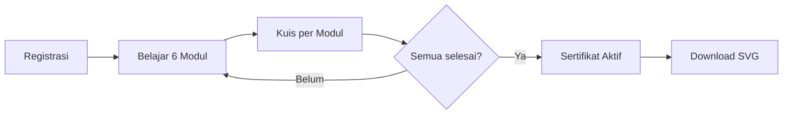

# Panduan Pengoperasian Website
> Program **FOLUR UNDP** — WebGIS Interaktif + Modul Pembelajaran

Website pelatihan penguatan kapasitas **Perencanaan Zonasi Spasial** untuk level Kabupaten. Menampilkan 30+ layer indikator spasial hasil agregasi AHP (Analytical Hierarchy Process), dengan AI assistant **Ka Zoni** untuk analisis spasial.

**Production**: [pelatihan-zonasi.diffa.net](https://pelatihan-zonasi.diffa.net)

## Pelatihan Perencanaan Zonasi Spasial Kabupaten Luwu
> **Program FOLUR UNDP** — Versi 2026

---

## Daftar Isi

1. [Pengenalan](#1-pengenalan)
2. [Halaman Utama (Beranda)](#2-halaman-utama-beranda)
3. [Peta Interaktif — Tampilan Umum](#3-peta-interaktif--tampilan-umum)
4. [Navigasi & Bilah Atas](#4-navigasi--bilah-atas)
5. [Panel Layer (Kiri)](#5-panel-layer-kiri)
6. [Dock Toolbar (Bawah)](#6-dock-toolbar-bawah)
7. [Digitasi & Upload Poligon](#7-digitasi--upload-poligon)
8. [Clip & Hitung Luas](#8-clip--hitung-luas)
9. [Analisis Lokasi (Titik)](#9-analisis-lokasi-titik)
10. [Ka Zoni — AI Assistant](#10-ka-zoni--ai-assistant)
11. [Tambah Layer (Upload Data)](#11-tambah-layer-upload-data)
12. [Basemap Switcher](#12-basemap-switcher)
13. [Pencarian Lokasi](#13-pencarian-lokasi)
14. [Cetak Peta](#14-cetak-peta)
15. [Sertifikat & Progres Belajar](#15-sertifikat--progres-belajar)
16. [Referensi Cepat](#referensi-cepat)

---

## 1. Pengenalan

Website ini adalah platform **WebGIS interaktif** untuk pelatihan Perencanaan Zonasi Spasial Kabupaten Luwu, Sulawesi Selatan.

**URL**: [pelatihan-zonasi.diffa.net](https://pelatihan-zonasi.diffa.net)

| Komponen | Fungsi |
|----------|--------|
| 🗺️ Peta Interaktif | Visualisasi 30+ layer indikator spasial |
| 📚 Modul Pelatihan | 6 modul pembelajaran + kuis interaktif |
| 🤖 Ka Zoni AI | Asisten AI untuk analisis spasial |
| 📐 Clip & Hitung Luas | Analisis area dengan poligon custom |
| 📂 Upload Layer | Tambah data sendiri (GeoJSON / Shapefile) |

---

## 2. Halaman Utama (Beranda)

Halaman `/` berisi: judul, logo FOLUR UNDP, ringkasan program, tombol navigasi ke Peta & Modul, dan form registrasi peserta (nama untuk sertifikat).

---

## 3. Peta Interaktif — Tampilan Umum

```
 ┌──────────────────────────────────────────────────────────────────┐
 │  🛡️ TRAINING RENCANA ZONASI   │  🔍 Cari lokasi...  │ 🏠 Modul  │
 │      Kabupaten Luwu            │                     │ Peta ✓   │
 ├──────────┬─────────────────────┬─────────────────────────────────┤
 │          │                     │  ┌─────────────────────────┐    │
 │  Layers  │                     │  │  Hasil Clip             │    │
 │  (MCE-   │                     │  │  X1.2 Curah Hujan       │    │
 │   SEM/   │                     │  │  Kelas 1  15.09 rb ha   │    │
 │   PLS)   │                     │  │  Total: 37.28 rb ha     │    │
 │          │                     │  └─────────────────────────┘    │
 │ 30 layer │      🗺️  PETA       │                                 │
 │   siap   │                     │  ┌─────────────────────────┐    │
 │          │                     │  │  🤖 Ka Zoni             │    │
 │ X1 ✓     │                     │  │  AI chat — analisis     │    │
 │  ├ X1.2 ✓│                     │  │  spasial + query layer  │    │
 │  ├ X1.3 ✓│                     │  └─────────────────────────┘    │
 │ X2       │                     │                                 │
 │  ...     │                     │                                 │
 │          │  ┌──────────────────┴─────┐                           │
 │          │  │ ◇ Poligon Garis Titik ⬆ │ Buffer: 50 m            │
 │          │  ├─────────────────────────┤                          │
 │          │  │ 📂 🔲 ✏️ ✂️ 🗑️ 🗺️ 🎯 ⛶ 🖨 ⬇ 🤖 │                 │
 │          │  └─────────────────────────┘                          │
 ├──────────┴──────────────────────────────────────────────────────┤
 │  © OpenStreetMap          3.5615° S, 120.1728° E │ Zoom: 11     │
 └─────────────────────────────────────────────────────────────────┘
```

---

## 4. Navigasi & Bilah Atas

| Item | Fungsi |
|------|--------|
| 🛡️ Logo + JUDUL | Identitas |
| 🔍 Search Box | Cari lokasi (Nominatim) — ketik, Enter, peta zoom |
| 🏠 | Beranda |
| Modul Pelatihan | Halaman modul |
| Peta Interaktif | Halaman aktif (highlight hijau) |

---

## 5. Panel Layer (Kiri)

Klik **📂 Layers** di Dock untuk buka/tutup.

### 6 Kelompok Indikator

| Ikon | Grup | Layer | Bobot |
|------|------|-------|-------|
| 🌿 | X1 Kerentanan Fisik | 4 | 0.136 |
| 🌾 | X2 Kerentanan Sosek | 5 | 0.080 |
| ⛰️ | X3 Daya Dukung LH | 5 | 0.258 |
| 🏔️ | X4 Kemampuan Lahan | 5 | 0.138 |
| 🏗️ | X5 Kapasitas Adaptasi | 5 | 0.167 |
| 🌍 | X6 Komoditas FOLUR | 6 | 0.120 |

**Cara pakai**: ☑ centang = layer muncul + legenda inline, ☐ hilangkan = sembunyi.

---

## 6. Dock Toolbar (Bawah)

11 tombol di dock 3D:

| # | Ikon | Nama | Status Awal |
|---|------|------|-------------|
| 1 | 📂 | Layers | Aktif |
| 2 | 🔲 | Selection | Toggle |
| 3 | ✏️ | Digitasi / Upload | Toggle |
| 4 | ✂️ | Clip & Hitung Luas | Disabled |
| 5 | 🗑️ | Hapus Poligon | — |
| 6 | 🗺️ | Base Map | Toggle |
| 7 | 🎯 | Ke Tengah | — |
| 8 | ⛶ | Layar Penuh | Toggle |
| 9 | 🖨️ | Cetak Peta | — |
| 10 | ⬇️ | Download | Disabled |
| 11 | 🤖 | Ka Zoni | Toggle |

**Indikator**: Hijau = aktif, Abu-abu = normal, Transparan = disabled.

---

## 7. Digitasi & Upload Poligon

1. Klik ✏️ **Digitasi / Upload**
2. Pilih mode: **Poligon** / **Garis** / **Titik** / **Upload**
3. Untuk poligon: klik peta → double-click selesai
4. Untuk upload: pilih file `.geojson` / `.json`
5. Untuk garis/titik: atur **Buffer (m)** → otomatis jadi poligon

---

## 8. Clip & Hitung Luas

1. **Buat poligon** (digitasi/upload) → ✂️ aktif
2. **Centang layer** di panel kiri
3. Klik ✂️ → panel hasil muncul di kanan atas
4. Output: luas per kelas (ha) per layer + **grand total**
5. Ka Zoni **otomatis membuka** dan menganalisis hasil

---

## 9. Analisis Lokasi (Titik)

1. ✏️ → **Titik**
2. Klik satu titik di peta
3. Hasil: tabel semua layer aktif + kelas pada koordinat tersebut

---

## 10. Ka Zoni — AI Assistant

- Klik 🤖 di Dock → panel chat kanan
- Didukung **Llama 3.2 3B** (Cloudflare Workers AI)
- Ketik pertanyaan GIS → Enter
- **Auto-analisis** setelah Clip & Hitung Luas

---

## 11. Tambah Layer (Upload Data)

1. Panel Layers → scroll bawah → **+ Tambah Layer**
2. Pilih `.geojson` / `.zip` (shapefile)
3. Layer muncul di **📂 User Layers**, auto-visible, warna unik, peta zoom ke data

---

## 12. Basemap Switcher

🗺️ → pilih: **OSM Streets** / **Satellite** (ESRI) / **Carto Light** / **Dark Mode**

---

## 13. Pencarian Lokasi

Ketik di 🔍 navbar → Enter → peta zoom ke lokasi.

---

## 14. Cetak Peta

🖨️ → dialog print browser → hanya peta + judul yang tercetak (UI otomatis disembunyikan).

---

## 15. Sertifikat & Progres



---

## 16. Referensi Cepat

### Warna Kelas

| Kelas | Warna | Label |
|-------|-------|-------|
| 1 | 🔴 `#d73027` | Sangat Rendah |
| 2 | 🟠 `#fc8d59` | Rendah |
| 3 | 🟡 `#fee08b` | Sedang |
| 4 | 🟢 `#91cf60` | Tinggi |
| 5 | 🔵 `#1a9850` | Sangat Tinggi |
